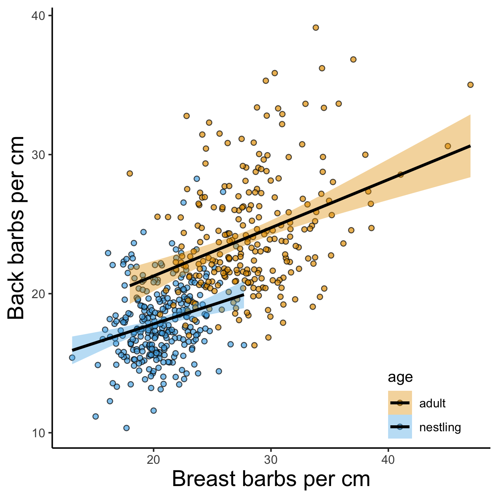

```{r setup, include=FALSE}
knitr::opts_chunk$set(echo = TRUE)
```

# General Justification 

The goal of this paper is mostly to repeat the analyses of Callan et al within a single species. They found that across many species there was evidence for a trade-off in feather barb density vs. time in the nest. They interpret the pattern as evidence for selection on faster fledging resulting in reduced allocation of resources to feather quality, since nestling feathers are ephemeral traits. The same logic could apply within species across resources or for individuals on different developmental trajectories. 

I think a lot of our framing should focus on the question of when you expect to see the same trade-off relationship between vs. within species and what that means. In the Callan introduction, they talk about the development speed vs. adult lifespan tradeoff, which is apparent within each species but not across species. This is like to be the opposite case, where the strong relationship that Callan et al find across species does not hold within species. Why is that? Anurag's presidential review paper from last year is all about this question and should be a really good foundation for explaining the difference.

The Callan paper also identifies 2 explicit factors and 1 implied factor that we can explore here:
- Time in nest. We have exact fledge dates and we can also use morphology on day 15 as a proxy for speed of development.
- Predation risk. We experimentally manipulate perceived predation risk in the two years although the treatment is mostly targeted at adults.
- Available resources. Perhaps this is the most important in determining both the prior two and in whether a resource allocation tradeoff occurs? Because we cross fostered nestlings into nests with (presumably) different resource access, we can address this.

Thinking of Anurag's paper and the role of developmental plasticity, the Callan result could arise in three ways.
- Each species follows a similar positive relationship between time in nest and quality of ephemeral feathers.
- Each species has a negative relationship, but aggregated = positive. Perhaps this could result if resource availability overwhelms any strategic consideration so that low resources = both long development AND lower quality feathers.
- Each species has no relationship (no plasticity), but together they form the positive relationship. This seems to be the empirical pattern we recover.

# Visualizing the trade off

\

**Figure 0.** The between species tradeoff reported in Callan et al (A; redrawn from data in Dryad package) could result from different underlying within species patterns. We used the same mean species points presented in Callan et al and simulated within species relationships between time in the nest and plumage quality that were positive (B), negative (C), absent (D), or heterogenous between species (D). All four within-species patterns produce the same between species result. Our simulation used the 'rnorm' function in R to randomly choose ranges of time in nest for each species and slopes with different means and variation for illustration purposes only.

# Validating the method

## Is the measurement repeatable across observers?

\

**Figure 1.** Comparison of the same feather measured by two different observers. Each pair of observers is a different color. This practice set includes both back and breast feathers. The dashed black line indicates a slope of 1 and the solid line and confidence interval shows the observed relationship for repeated measurements.

## Are multiple feathers from the same bird similar?

\

**Figure 2.** Comparison of two feathers from the same bird measured independently.

## Adults vs. nestlings

\

**Figure 3.** Comparison of adult and nestling distribution of breast (A) and rump (B) feather barbule density measurements.

## Breast vs. rump

\

**Figure 4.** Comparison of breast vs. rump feather barbule density.

## Pairwise nestling similarity

\

**Figure 5.** Pairwise similarity in breast barbule density measurements for each possible pair of two nestlings. Panel A shows absolute difference in measured barbule density is shown by by relationship, with unrelated nestlings, half-siblings, and full siblings indicated by 0, 1, and 2 respectively. Panel B shows the similarity for pairs of nestlings raised in the same or different nests and Panel C is a density plot for each combination of nest of origin and relatedness group.

\

**Figure 6.** Pairwise similarity in breast barbule density measurements for each possible pair of two nestlings. Panel A shows absolute difference in measured barbule density is shown by by relationship, with unrelated nestlings, half-siblings, and full siblings indicated by 0, 1, and 2 respectively. Panel B shows the similarity for pairs of nestlings raised in the same or different nests and Panel C is a density plot for each combination of nest of origin and relatedness group.

## Fledge age by feathers

\

**Figure 7.** Fledging age of nestlings in relation to breast (A) or rump (B) feather barbule density and treatment type. 

## Nestling vs. genetic parents

\

**Figure 8.** Nestling feather density measurements vs. genetic parents and mid-parent values for breast and rump.

## Nestling vs. social parents

\

**Figure 9.** Nestling feather density measurements vs. social parents and mid-parent values for breast and rump.


